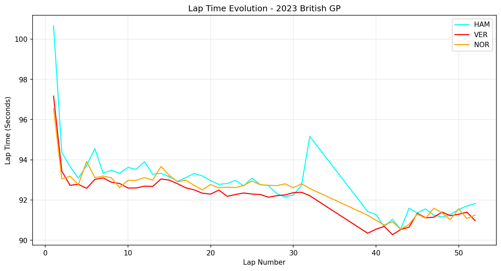
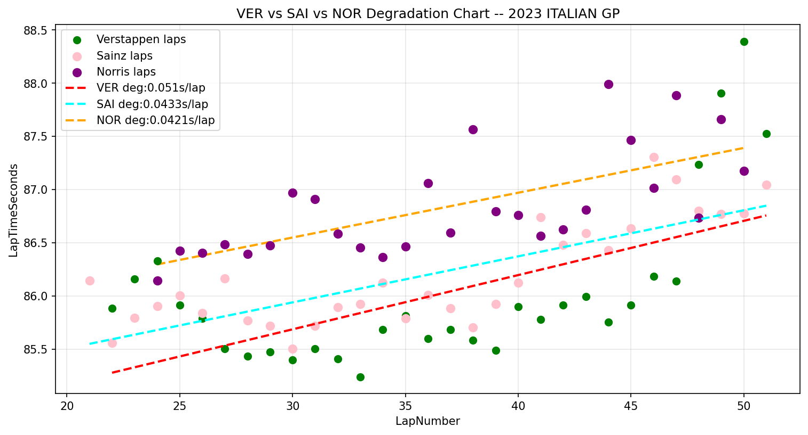

# F1 Telemetry Analysis

Python-based Formula 1 race data analysis using the FastF1 library.
Pulls official F1 timing data to analyze driver performance,
tyre degradation, and race strategy.

## Analyses

### 1. Lap Time Comparison
Multi-driver pace evolution across a full race distance.
Identifies performance gaps, tyre stint transitions, and strategic windows.

**2023 British GP — HAM vs VER vs NOR**


### 2. Tyre Degradation Model
Linear regression model measuring tyre degradation rate (seconds lost per lap)
for each driver on a given compound.

**2023 Italian GP (Monza) — VER vs SAI vs NOR**



| Driver | Deg Rate | Compound |
|--------|----------|----------|
| VER    | 0.051s/lap | Hard   |
| SAI    | 0.043s/lap | Hard   |
| NOR    | 0.042s/lap | Hard   |

## Tech Stack

- Python 3.13
- FastF1 3.8.2
- Matplotlib
- NumPy
- Pandas

## Setup

```bash
pip install -r requirements.txt
```

## Project Structure
analysis/
lap_time_analysis.py     # Multi-driver pace comparison
degradation_model.py     # Tyre degradation regression model
outputs/
monza_2023_degradation.png

## Author

Edward | github.com/Novice-max
Targeting F1 Systems Engineering roles